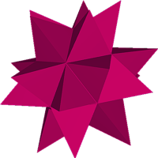
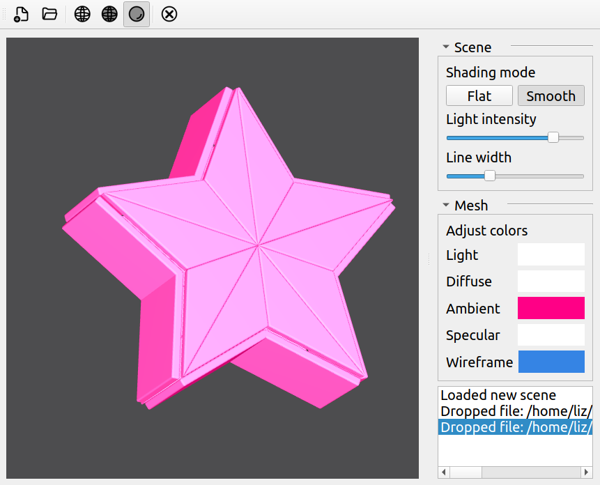
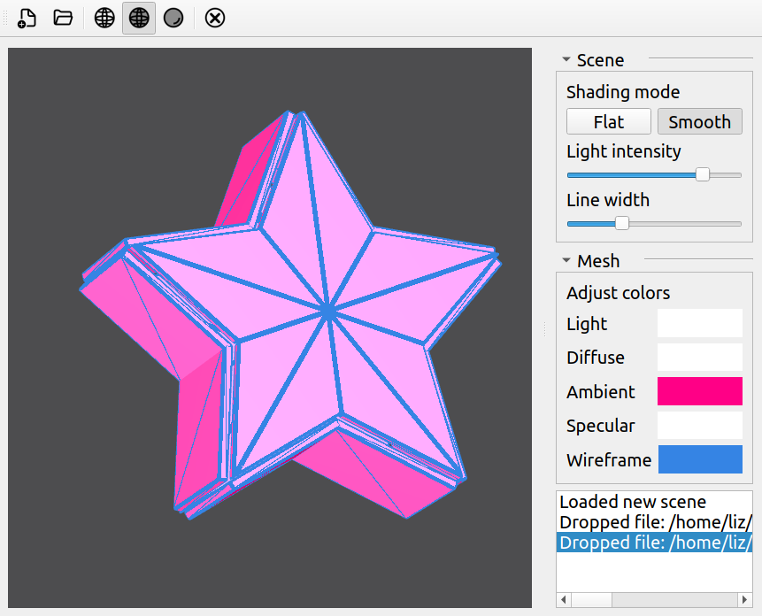
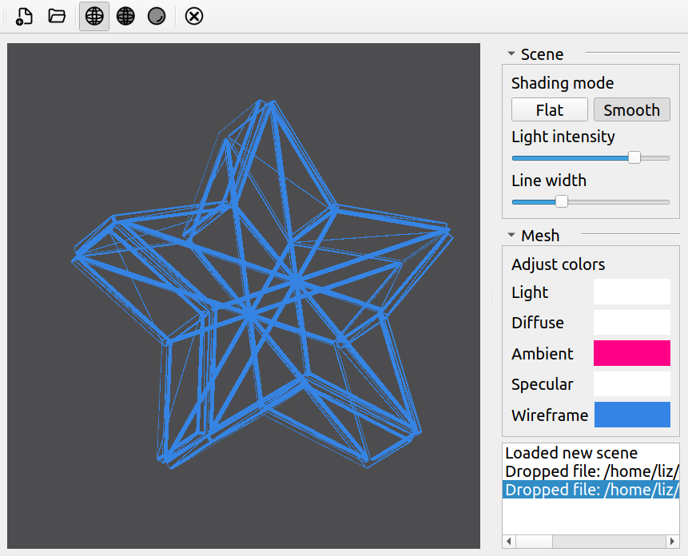
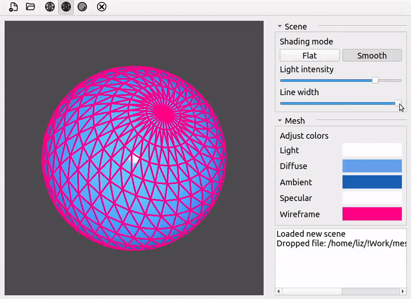
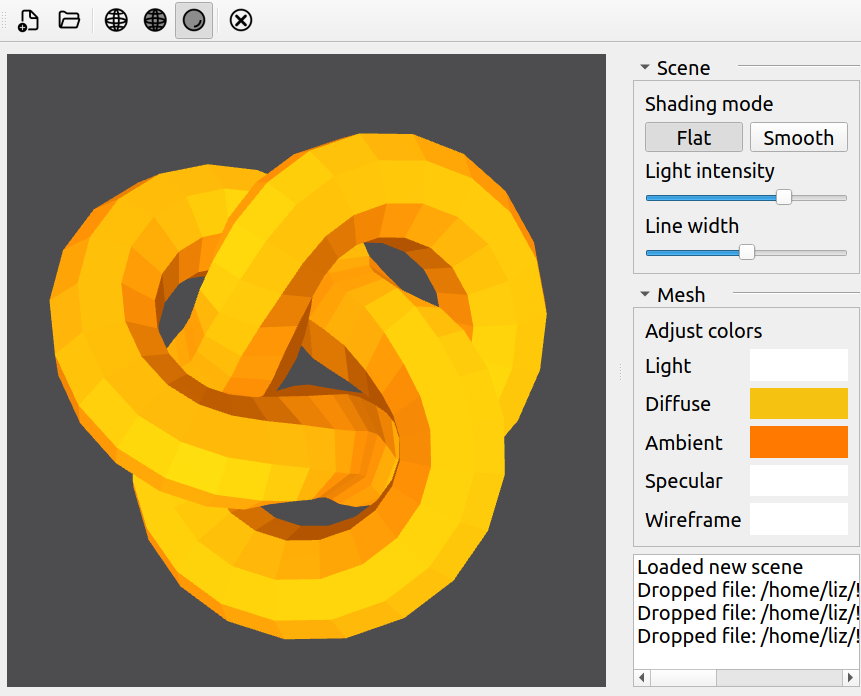
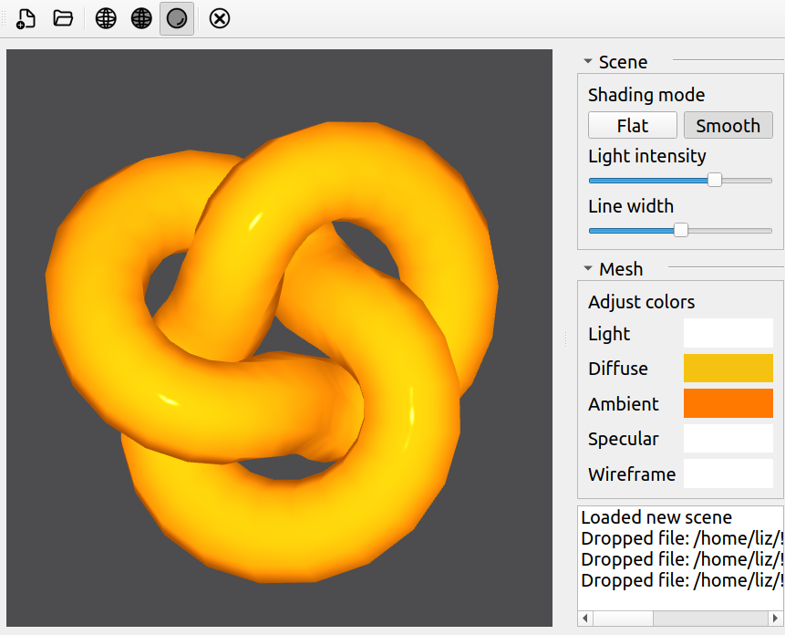

 

  
  <h3 align="center">MeshViewer</h3>
   

      A simple mesh viewer made with Qt
         
      <a href="#features">Features</a>
      ·
      <a href="#controls">Controls</a>
      ·
      <a href="#installation">Installation</a>
    

This is a basic mesh viewer made with Qt on C++ that allows you to display 3D meshes.
  

    
  

## Features

MeshViewer allows you to display 3D objects of .ply, .obj & .stl formats. You can adjust various color properties of the object. You can set the lighting, diffuse, ambient and specular colors. MeshViewer allows you to render 3D objects in "Face only", "Face + Wireframe" and "Wireframe" mods, with modifiable wireframe line width & color:
  

    
    
        
  

  

    
  

  

  MeshViewer has an option for you to change between flat and smooth shading modes with adjustable light intensity. This is achieved via computing normals  in slightly different ways in the fragment shader 
  

    

      
      
    

  

  This project uses Qt 5.12 for user interface, and OpenGL for graphical effects. MeshViewer includes the custom camera controller class, a mesh class with custom material, and GLSL shaders for custom effects (wireframe + flat shading). Custom features were implemented for the sake of better flexibility of the program. In the "test-meshes" directory you can find some basic models that you can display in the program, but anything of the .ply, .obj, and .stl format will be ok as well. 
  

## Controls

  
Left Mouse Button : Rotate mesh

  
W/S || ⇧/⇩	: Rotate mesh (z axis)

  
A/D || ⇦/⇨	: Rotate mesh (x axis)

  
Mouse Wheel	: Zoom in/out

  
Ctrl + N	  : New empty scene

  
Ctrl + O	  : Open new file

  
Ctrl + Q	  : Quit

## Installation
